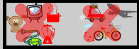

<h1 style="text-decoration: underline; color:black"> Audio Recording Tips

<h2 style="text-decoration: underline; color:brown"> Good Quality Audio Narration

<h4 style="color:black; font-family:Times New Roman"> The quality of your narration helps onscreen learning. Practice your narration before you record your screencast.

<h2 style="text-decoration: underline; color:brown">  Find a Quiet Spot in your House

<h4 style="color:black; font-family:Times New Roman"> Avoid noise as much as possible. If noise overlaps your speech, post production audio cleaning tends to degrade audio quality.

<h2 style="text-decoration: underline; color:brown"> Choose the Right Mic

<h4 style="color:black; font-family:Times New Roman"> Different mics have different recording characteristics. Reading the brochure should help understand its characteristics.

<h2 style="text-decoration: underline; color:brown"> Place Blankets/Pillows Around your Recording Equipements 

<h4 style="color:black; font-family:Times New Roman"> This helps cancel out noise from equipements like PCs and laptops.

<h2 style="text-decoration: underline; color:brown">  Clap Around the Room

<h4 style="color:black; font-family:Times New Roman"> This helps detect rooms or areas with echo. Avoid rooms with echoes as it cannot be edited out of your narration.

<h2 style="text-decoration: underline; color:brown"> A Room with Furniture Helps Cancel Echo

<h4 style="color:black; font-family:Times New Roman"> Wood and other absorbing textures dampen echo and enhance audio quality. Record in a room that has furniture.

<h2 style="text-decoration: underline; color:brown"> Clothes are the Best Way to Avoid Echoes

<h4 style="color:black; font-family:Times New Roman"> It's preferable to work in a room with clothes hung on all sides.

<h2 style="text-decoration: underline; color:brown"> Avoid Editing Your Audio

<h4 style="color:black; font-family:Times New Roman"> Do not use preset filters or noise removal techniques in your audio.

<h2 style="text-decoration: underline; color:brown"> Maintain a Steady Distance from the Mic

<h4 style="color:black; font-family:Times New Roman"> Always maintain a fixed distance from the mic. Place it ideally 10cms from your mouth.

<h2 style="text-decoration: underline; color:brown"> Listen to Your Narration

<h4 style="color:black; font-family:Times New Roman"> You can always improvise before you submit the content.
